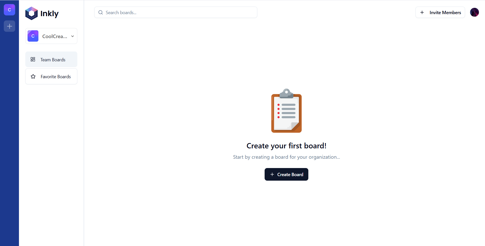

# Inkly

## Description
### Disclaimer: only for large screens(computers, laptops, tablets)
A cool and simple whiteboard application built using next.js. Uses liveblocks for the multi user presence.

## Features
- Real- time collaboration: Invite your team and work together with instant syncing.
- Various elements: Add a variety of objects to your board like textboxes, rectangles, drawings and more!
- Live previews and tracking: Track what your teammates do by seeing their cursors on your screen and see live previews.
- Organizations: Create organizations to add different teams and people to them, with separate boards and contents.
- Favorites: Add boards to your favorites and access them with ease.
- Layers: With many layers in the board, control the z-index any layer!

## Gallery

 

